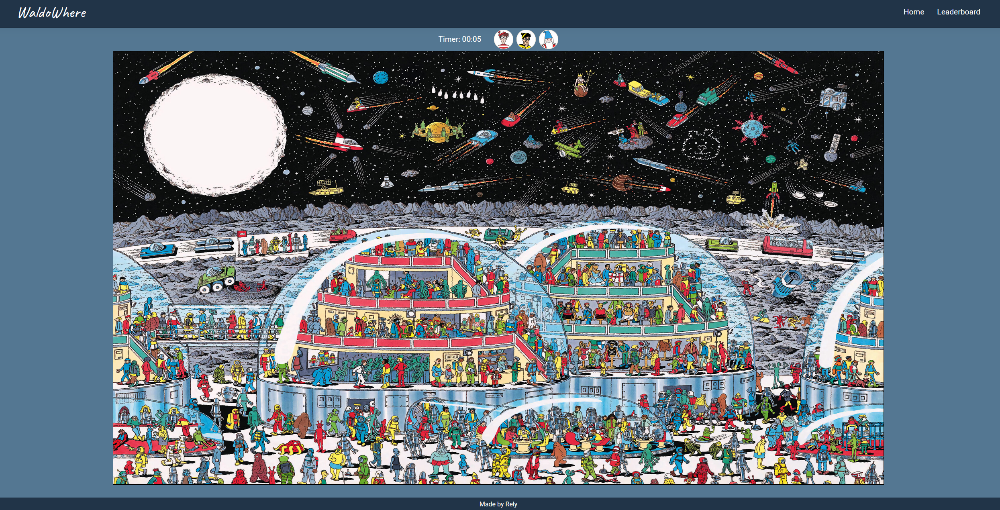

<div align="center">

<h2> Waldo Where : Where's Waldo game </h2>




</div>

## 💡 Overview

Waldo where is my version of a well known Where's Waldo game first publicized in UK children books. Creating this app taught me a lot about frontend and backend timer synchronization and working with event positions and offsets. 
As well as app deployment and backend test.

## ✨ Features
-  Play a game of where's waldo
-  Frontend & backend synchronized timer.
-  Leaderboards.
-  Uses session for user management
-  Custom toast notification for game guesses.
-  Database used to store users timers and game character coordinates

## 👩‍💻 Tech Stack

- **Vite**: Quick and easy to work with build tool for my react App.
- **React**: Open source frontend library to easily create reactive user interfaces.
- **React Router**: Routing library that help build Single page applications.
- **Express.js**: Easy to use Node.js web framework.
- **Prisma.io**: Amazing ORM for Node.js very natural to work with used with PostgreSQL.

## 📖 Sources and external API's

- No external API used.

## 📦 Getting Started

To get a local copy of this project up and running, follow these steps.

### 🚀 Prerequisites

- **Node.js**
- **Npm**
- **PostgreSQL** (or another supported SQL database).

## 🛠️ Installation

1. **Clone the repository:**

   ```bash
   git clone https://github.com/Relyful/WaldoWhere.git
   cd WaldoWhere
   ```

2. **Install dependencies:**

   Using Npm in backend and also frontend directories:

   ```bash
   npm install
   ```

3. **Set up environment variables:**

   Create a `.env` file in the root directory of backend and frontend and add the following variables:

**Frontend**
   ```env
   VITE_BACKEND_ADDRESS=http://localhost:3000
   ```
**Backend**
   ```env
   DATABASE_URL="Your database connection URL"
   ALLOWED_ORIGIN="Your frontend address for cors to recognise and allow"
   SECRET="Secret string for jwt authentication"
   ```
4. **Run database migrations:**

   Ensure your database is running and then run:

   ```bash
   npx prisma migrate dev
   npx prisma generate
   ```
   You'll also need seed database with correct character coordinates.
   To make this easier you can use my seed script in backend directory

   ```bash
   cd backend
   node seed.js
   ```

  5. **Start the development server:**

   ```bash
   cd frontend
   npm run dev
   cd ../backend
   node --watch app.js
   ```

## 📜 License

Distributed under the MIT License. See [License](/LICENSE) for more information.

Thank you for checking out my project! :)
